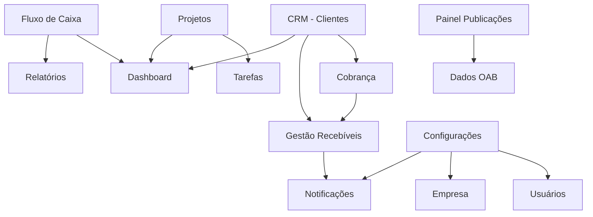

# 📋 DOCUMENTAÇÃO SISTEMA SAAS ADVOCACIA

## 🎯 VISÃO GERAL E ARQUITETURA

### Resumo Executivo

Sistema SAAS (Software as a Service) para gestão completa de escritórios de advocacia, oferecendo múltiplos módulos integrados com isolamento de dados por tenant e diferentes níveis de acesso por tipo de conta.

---

## 🏗️ ARQUITETURA GERAL

### Stack Tecnológico Principal

- **Frontend**: React 18 + TypeScript + Vite + TailwindCSS
- **Backend**: Node.js + Express + TypeScript
- **Banco de Dados**: PostgreSQL com separação por Schema
- **Autenticação**: JWT + Refresh Token Rotativo
- **Armazenamento**: AWS S3 para arquivos
- **Notificações**: Sistema interno + APIs externas

### Arquitetura Multi-Tenant

```
PostgreSQL Database
├── tenant_1_schema/
│   ├── users
│   ├── clients
│   ├── projects
│   ├── tasks
│   └── ...
├── tenant_2_schema/
│   ├── users
│   ├── clients
│   └── ...
└── admin_schema/
    ├── tenants
    ├── plans
    └── system_logs
```

---

## 🔐 SISTEMA DE SEGURANÇA

### Autenticação e Autorização

- **JWT Access Token**: 15 minutos de validade
- **Refresh Token Rotativo**: 7 dias, renovado a cada uso
- **Hash de Senhas**: bcrypt com salt rounds 12
- **Rate Limiting**: Por endpoint e por tenant

### Isolamento de Dados

- **Schema por Tenant**: Isolamento completo no PostgreSQL
- **Middleware de Tenant**: Identificação automática via JWT
- **Validação de Acesso**: Por tipo de conta e tenant

---

## 👥 TIPOS DE CONTA

### 1. Conta Simples

- **Dashboard**: Apenas estatísticas de clientes (gráficos financeiros zerados)
- **Funcionalidades**: CRM, Projetos, Tarefas básicas
- **Limitações**: Sem acesso a dados financeiros detalhados

### 2. Conta Composta

- **Dashboard**: Acesso completo a todos os gráficos
- **Funcionalidades**: Todos os módulos exceto Configurações
- **Permissões**: Visualização e edição de dados financeiros

### 3. Conta Gerencial

- **Dashboard**: Acesso total + métricas avançadas
- **Funcionalidades**: Todos os módulos incluindo Configurações
- **Permissões**: Administração completa do tenant

---

## 🔗 INTEGRAÇÕES EXTERNAS

### APIs Principais

- **Resend API**: Envio de emails e notificações
- **Stripe API**: Processamento de pagamentos
- **WhatsApp Business API**: Notificações via n8n
- **APIs Jurídicas**: CNJ-DATAJUD / Codilo / JusBrasil

### Rate Limiting Strategy

```javascript
// Configuração de Rate Limiting
{
  stripe: { requests: 100, window: '1h' },
  resend: { requests: 1000, window: '1h' },
  whatsapp: { requests: 50, window: '1h' },
  juridicas: { requests: 200, window: '1h' }
}
```

---

## 📊 DIAGRAMA DE RELACIONAMENTOS



---

## 🔄 FLUXO PADRÃO CRUD

### Para TODAS as operações (Create, Update, Delete):

1. **🔍 Validação de Entrada**

   - Schema validation (Zod)
   - Verificação de permissões
   - Validação de tenant

2. **💾 Operação no Banco**

   - Transação segura
   - Registro na tabela principal
   - Log de auditoria

3. **📝 Registro de Auditoria**

   ```sql
   INSERT INTO audit_log (
     tenant_id, user_id, table_name,
     operation, old_data, new_data,
     timestamp, ip_address
   )
   ```

4. **🔔 Sistema de Notificações**

   - **Interna**: Para contas do mesmo tenant
   - **Externa**: Para clientes (quando aplicável)
   - **Log**: Registro de todas as notificações

5. **📊 Atualização de Métricas**
   - Recálculo de indicadores afetados
   - Atualização de cache quando necessário

---

## 🗃️ ESTRUTURA DE DADOS

### Schema Base por Tenant

```sql
-- Tabelas principais por tenant
CREATE SCHEMA tenant_{id};

-- Usuários do tenant
CREATE TABLE tenant_{id}.users (
  id UUID PRIMARY KEY,
  email VARCHAR UNIQUE,
  password_hash VARCHAR,
  account_type ENUM('simples', 'composta', 'gerencial'),
  is_active BOOLEAN DEFAULT true,
  created_at TIMESTAMP,
  updated_at TIMESTAMP
);

-- Clientes (CRM)
CREATE TABLE tenant_{id}.clients (
  id UUID PRIMARY KEY,
  name VARCHAR,
  email VARCHAR,
  phone VARCHAR,
  created_by UUID REFERENCES tenant_{id}.users(id),
  -- outros campos...
);

-- Projetos
CREATE TABLE tenant_{id}.projects (
  id UUID PRIMARY KEY,
  client_id UUID REFERENCES tenant_{id}.clients(id),
  -- outros campos...
);

-- Auditoria
CREATE TABLE tenant_{id}.audit_log (
  id UUID PRIMARY KEY,
  user_id UUID,
  table_name VARCHAR,
  operation VARCHAR,
  old_data JSONB,
  new_data JSONB,
  timestamp TIMESTAMP DEFAULT NOW()
);
```

---

## 🔒 ADMINISTRAÇÃO GLOBAL

### Schema Admin (Fora dos Tenants)

```sql
CREATE SCHEMA admin;

-- Tenants cadastrados
CREATE TABLE admin.tenants (
  id UUID PRIMARY KEY,
  name VARCHAR,
  schema_name VARCHAR UNIQUE,
  plan_type VARCHAR,
  is_active BOOLEAN,
  created_at TIMESTAMP
);

-- Logs do sistema
CREATE TABLE admin.system_logs (
  id UUID PRIMARY KEY,
  tenant_id UUID,
  severity VARCHAR,
  message TEXT,
  metadata JSONB,
  timestamp TIMESTAMP
);
```

---

## 📈 MONITORAMENTO E OBSERVABILIDADE

### Métricas de Sistema

- **Performance**: Tempo de resposta por endpoint
- **Utilização**: Queries por tenant, storage usado
- **Erros**: Taxa de erro por módulo/API
- **Segurança**: Tentativas de login, acessos suspeitos

### Alertas Críticos

- **Alta utilização** de CPU/Memória
- **Falhas** em APIs externas
- **Tentativas** de acesso não autorizado
- **Falhas** no sistema de pagamentos

---

## 🚀 ESCALABILIDADE

### Horizontal Scaling

- **Load Balancer**: Distribuição de carga
- **Microservices**: Separação por módulo (futuro)
- **Cache**: Redis para dados frequentes
- **CDN**: Para arquivos estáticos

### Vertical Scaling

- **Database**: Read replicas para consultas
- **Storage**: S3 com CloudFront
- **Background Jobs**: Queue system (Bull/BullMQ)

---

## 📚 PRÓXIMOS PASSOS

1. ✅ **Documentação Módulos** (Próximo arquivo)
2. ✅ **Playbook Técnico** (DevOps/Backend)
3. ✅ **Anexo Métricas** (Fórmulas detalhadas)
4. ✅ **Error Handling** (Cenários e tratamentos)

---

_📅 Criado em: $(date)_  
_🔄 Última atualização: $(date)_  
_👤 Autor: Documentação Técnica_
